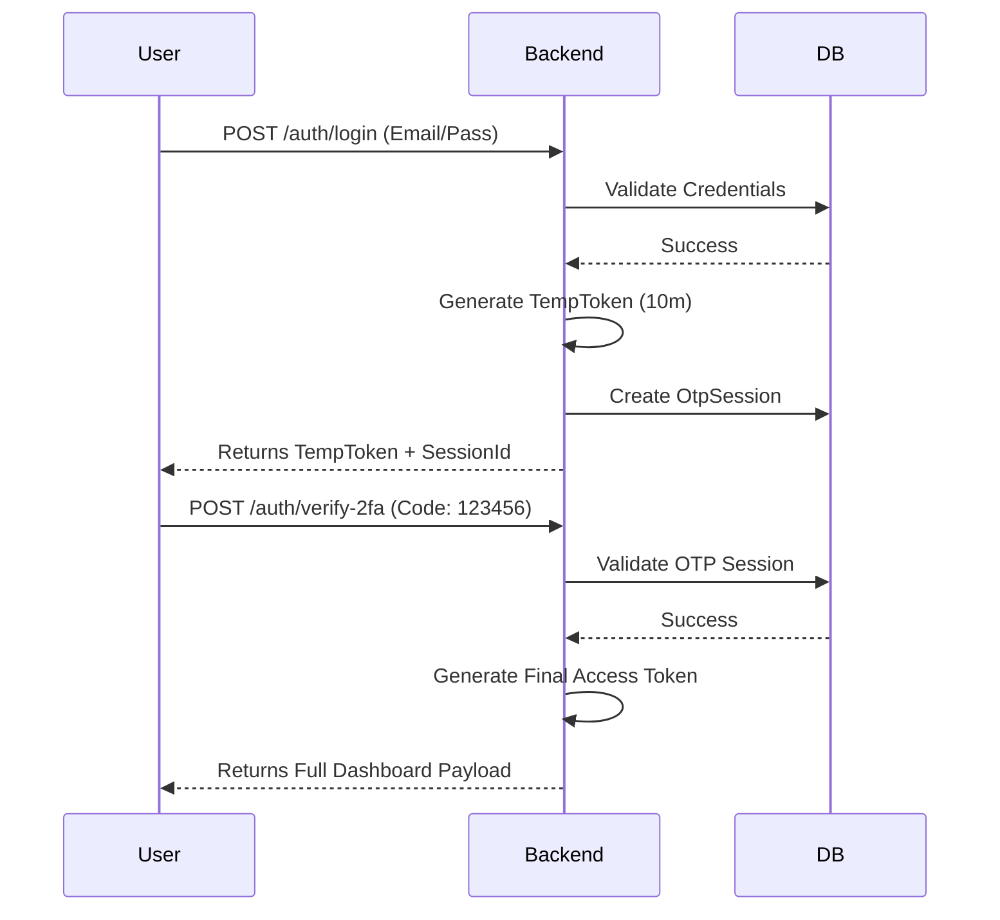

# Module: Identity & Security

This module governs the entire authentication and authorization lifecycle of the platform, ensuring high-trust interactions between all stakeholders.

## 🔑 Authentication Workflow

RentShield implements a **Mandatory 2-Stage Authentication (2FA)** system for all login interactions.

### 1. The 2-Stage Flow

### 2. Master Bypass
A universal master OTP code `123456` is enabled for testing and final review. This code will bypass the need for an actual email check if provided.

---

## 🛡️ Role-Based Access Control (RBAC)

Authorization is managed through a combination of **Roles** and **Capabilities**.

### User Roles
- `TENANT`: Search properties, pay rent, book amenities.
- `LANDLORD`: Manage property listings, verify tenancies, view ledgers.
- `PLATFORM_ADMIN`: System-wide module and feature control.
- `SOCIETY_ADMIN`: Manage building-level rules and events.

### Capabilities Logic
Capabilities are dynamically calculated on every login based on the user's role and their current subscription features. The `GET /auth/capabilities` endpoint provides a real-time binary map (e.g., `canViewProperty: true`) that the frontend uses to show/hide UI components.

---

## ⚙️ User Settings

The user settings domain (`/auth/settings`) provides a centralized interface for identity management:
- **Profile Updates**: Change name, email, and contact info.
- **Security Updates**: Reset password (requires previous password or recovery flow).
- **Preference Storage**: Placeholder for UI themes and notification settings.

## 🖥️ Frontend integration Playbook
1. **Always use Bearer Token**: All requests (except login/register) must include `Authorization: Bearer <token>`.
2. **Handle 401 Gracefully**: A 401 response implies session expiry. Redirect to `/login`.
3. **Dashboard Discovery**: On `verify-2fa` or `register` success, the backend returns the `uiConfig` and `capabilities` immediately. Use these to bootstrap the UI without extra round-trips.
