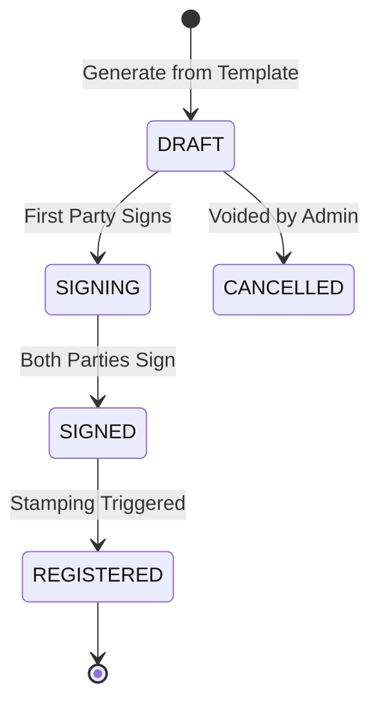

# Module: Smart Agreements

The Smart Agreement module automates the legal lifecycle of property rentals through dynamic template merging and digital signatures.

## 📝 Agreement State Machine

The agreement status transitions through a strict legal flow:

---

## 🏗️ Dynamic Template Engine

Agreements are generated using a placeholder-based template system stored in the database.

### 1. Placeholder Mapping
The engine (`AgreementService.generateAgreement`) replaces tags with real-time data:
- `{{TENANT_NAME}}`: Full name of primary tenant.
- `{{RENT_AMOUNT}}`: Found in `Property.price`.
- `{{START_DATE}}`: Pulled from `Tenancy.startDate`.

### 2. State-Specific Templates
Templates can be categorized by **State** (e.g., Maharashtra, Karnataka). This allows the system to include localized clauses (e.g., standard 11-month lock-in vs commercial notice periods) automatically.

---

## ✒️ E-Signature Signature Modes

We support dual-mode capturing to satisfy various user preferences:
- **TYPE**: A stylized text representation of the user's name. Standard for quick, digital-first agreements.
- **DRAW**: A base64-encoded image of the user's actual handwriting captured on a touchscreen or trackpad.

## 🖥️ Frontend Integration Playbook
1. **Signature Canvas**: Implement a `canvas` or `signature-pad` component for the `DRAW` mode.
2. **Real-time Preview**: Show the template text with the data merged in a pre-signing preview screen.
3. **Download Anchor**: Provide a PDF download button that appears only once the status reaches `SIGNED` or `REGISTERED`.
