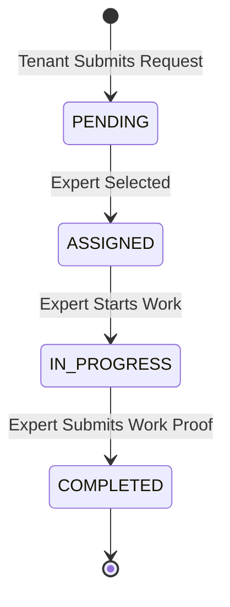

# Module: Tenancy Lifecycle Operations

This module manages the transition phases and operational maintenance of a property, focusing on "Move-In", "Maintenance", and "Move-Out/Exit" workflows.

## 📦 Onboarding (Move-In) flow

A structured onboarding process to ensure property quality and condition reporting.

### 1. The Checklist System
- **Categories**: Interior, Electrical, Plumbing, Cleaning.
- **Verification**: Tenant must mark each item as "OK" or "COMMENT".
- **Inspection Summary**: Once all items are verified, the `MoveIn` status transitions to `COMPLETED`.

---

## 🛠️ Maintenance & Service Expert Flow

The core system for operational repairs and ongoing property upkeep.

### 1. Request Lifecycle

### 2. Marketplace Integration
- **Direct Booking**: Tenants can browse the "Local Expert Marketplace" and directly book a verified plumber or electrician.
- **Auto-Payment Generation**: Completed maintenance tasks can automatically trigger a Ledger Entry for payment by the landlord or tenant.

---

## 🚪 Move-Out & Exit Lifecycle

Finalizing a tenancy with security deposit settlement and inspection.

### 1. The Exit Process
1. **Notice Period**: Validates against the lock-in period defined in the Smart Agreement.
2. **Exit Inspection**: Comparative checklist against the original Move-In condition.
3. **Financial Settlement**: Automated calculation of deductions (Damages, Unpaid Rent) vs Security Deposit.
4. **Final Closure**: Ledger is balanced and Tenancy status becomes `ENDED`.

## 🖥️ Frontend Integration Playbook
1. **Checklist Components**: Use an interactive "Checklist" UI with photo upload support for inspection items.
2. **Maintenance Trackers**: Show a "Progress Bar" or "Timeline" to tenants for active maintenance requests.
3. **Settlement Summary**: Clearly show the "Deposit Received" vs "Final Refund" breakdown in the Exit dashboard.
